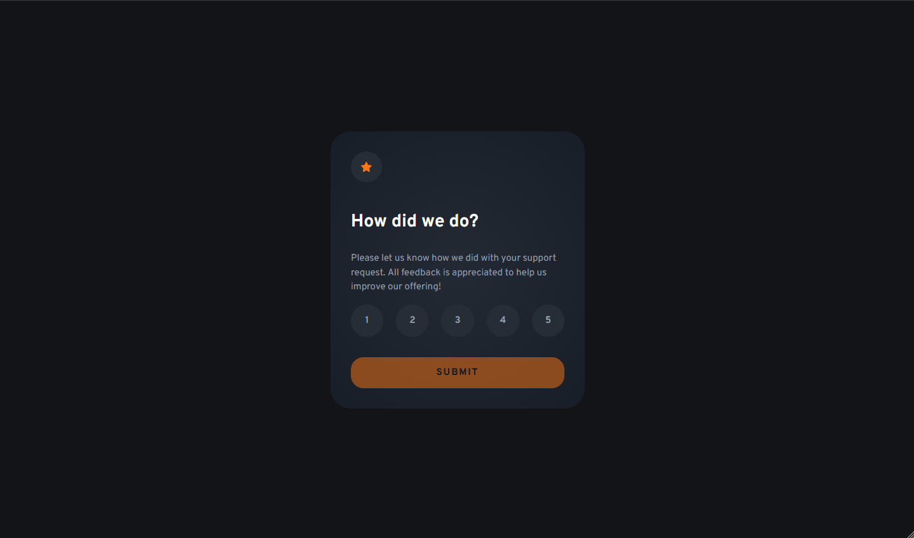

# Frontend Mentor - Interactive rating component solution

This is a solution to the [Interactive rating component challenge on Frontend Mentor](https://www.frontendmentor.io/challenges/interactive-rating-component-koxpeBUmI). Frontend Mentor challenges help you improve your coding skills by building realistic projects.

## Table of contents

- [Frontend Mentor - Interactive rating component solution](#frontend-mentor---interactive-rating-component-solution)
  - [Table of contents](#table-of-contents)
  - [Overview](#overview)
    - [The challenge](#the-challenge)
    - [Screenshot](#screenshot)
    - [Links](#links)
  - [My process](#my-process)
    - [Built with](#built-with)
    - [What I learned](#what-i-learned)
    - [Useful resources](#useful-resources)

## Overview

### The challenge

Users should be able to:

- View the optimal layout for the app depending on their device's screen size
- See hover states for all interactive elements on the page
- Select and submit a number rating
- See the "Thank you" card state after submitting a rating

### Screenshot



### Links

- Live Site URL: https://relaxed-eclair-d0d288.netlify.app/

## My process

### Built with

- Semantic HTML5 markup
- CSS custom properties
- Flexbox
- Mobile-first workflow
- View Transition API

### What I learned

- I explored the possibility of using `clamp()` to create responsive spacings between elements instead of using media-queries

```css
.section {
  padding: clamp(1rem, 5vw, 2rem);
}
```

- Experimented with View Transitions to display the "Thank you" page after submission

```js
function updatePages() {
  if (document.startViewTransition) {
    document.startViewTransition(() => {
      firstPage.style.display = "none";
      secondPage.style.display = "flex";
    });
  } else {
    firstPage.style.display = "none";
    secondPage.style.display = "flex";
  }
}
```

```css
::view-transition-old(main),
::view-transition-new(main) {
  animation-duration: 0.5s;
}

::view-transition-old(main) {
  animation-name: fade-out;
}

::view-transition-new(main) {
  animation-name: fade-in;
}

@keyframes fade-out {
  to {
    opacity: 0;
  }
}

@keyframes fade-in {
  from {
    opacity: 0;
  }
}
```

- Also, its so EASY to style radio buttons and still keep them accessible - no need to use complex solutions (I'm looking at you Shadcn!)

### Useful resources

- [View Transitions Tutorial](https://piccalil.li/blog/some-practical-examples-of-view-transitions-to-elevate-your-ui/) - provide a simple example of single-page view transitions
